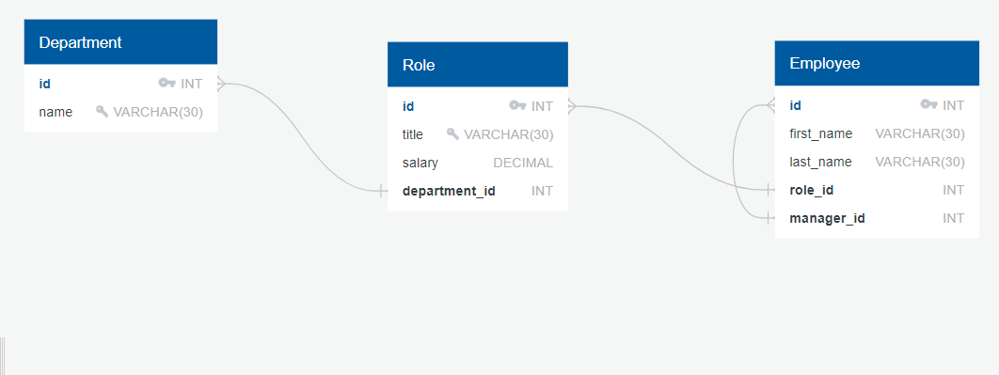
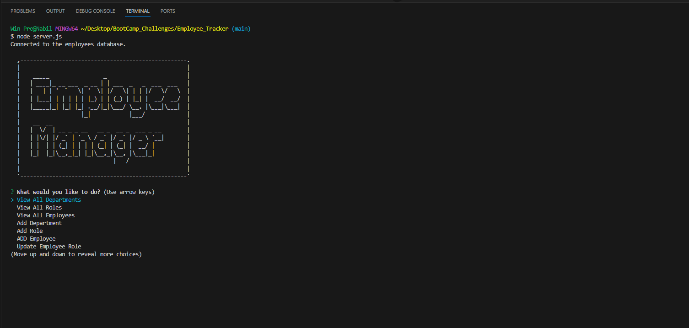

# Employee_Tracker
An application to manage and track employees, roles, and departments within an organization using a MySQL database.

## Description.

The Employee Manager is a Node.js application that interfaces with a MySQL database to manage employees, their roles, and departments. With the app, you can:
1. View all departments, roles, and employees.
2. Add new departments, roles, and employees.
3. Update an employee's role.
And more!
## Table Of Contents.
.Usage
.Installation
.Dependencies
.Contributing
.Demo
.Deployed Page Link
.Screen Shots

## Usage

1. Navigate to the project directory in your terminal.
2. Run node <your-main-app-file-name> to start the application.
3. Follow the on-screen prompts to manage your employees.

## Installation

1. Clone the repository to your local machine.

2. Navigate to the project directory in your terminal.

3. Run npm install to install necessary dependencies, which include:
mysql2: For database connections.
inquirer: For interactive command line user interfaces.
asciiart-logo: For displaying a fun logo.
console.table: For a formatted table output in the console.

4. Set up your MySQL database:
Ensure you have MySQL installed and running on your machine.
Use the provided schema.sql file to set up your database, departments, roles, and employees tables.
(Optional) Use the seeds.sql file to populate your tables with sample data.

5. Update the database connection configuration (user, password, database, etc.) in the main application file to match your local MySQL setup.
# To install the necessary dependencies, run:
bash
Copy code
\`\`\`
npm install
\`\`\`
This command will install the required packages.

# Running the Application:
To start the application, in your terminal type:

bash
Copy code
\`\`\`
mysql -u root -p (you will then be asked to provide your password)
\`\`\`

\`\`\`
source db/schema.sql;
\`\`\`

\`\`\`
source db/seeds.sql;
\`\`\`

\`\`\`
exit
\`\`\`

\`\`\`
node server.js
\`\`\`
Follow the on-screen prompts, answering questions about your project.

## Screen Shots

## Contributing
Contributions are always welcome! Please fork the repository and create a Pull Request with your changes.

## Demo.

https://drive.google.com/file/d/1UwsR3q1LlUGx_rup2h1TN4uzsrEoEZZ4/view

## Deployed Page Link.

